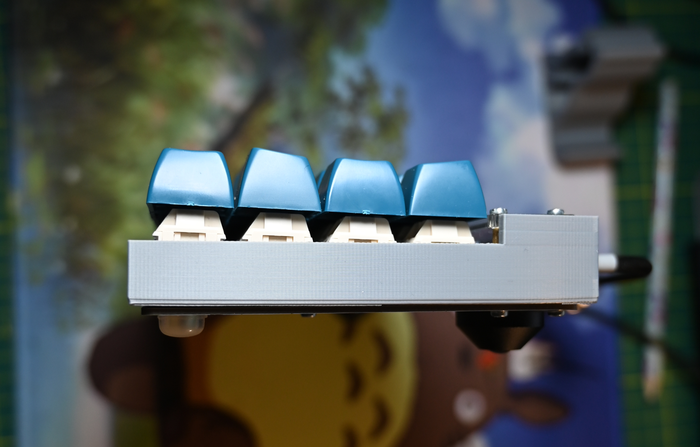
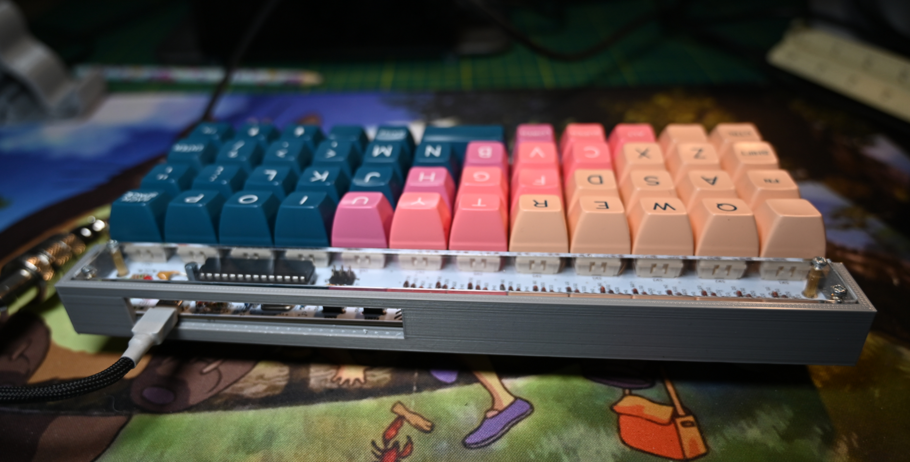

# Plaid Case designed by Me

featuring a really badly written scad file :)

Bear in mind that this case features a really tight fit and depending on the material you are using in most cases I would advice adding an extra millimeter.

Since I managed to push the plaid with some slight difficulty, I am not going to attempt reprinting. As you most know, it takes quite a long time for each attempt.

Any improvements are more than welcomed.

This case is not your ordinary case, its a combination of sandwich case and who knows a normal case :D
it's meant to be snugged between the top and bottom plate.

As a bonus I drilled two holes on the plate for a pair of feet, becomes I didn't like the angle much

